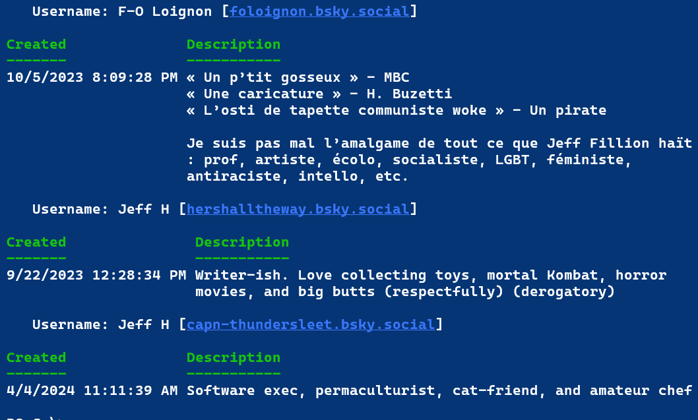
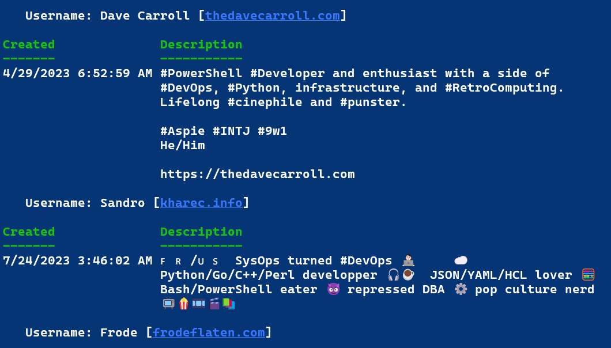
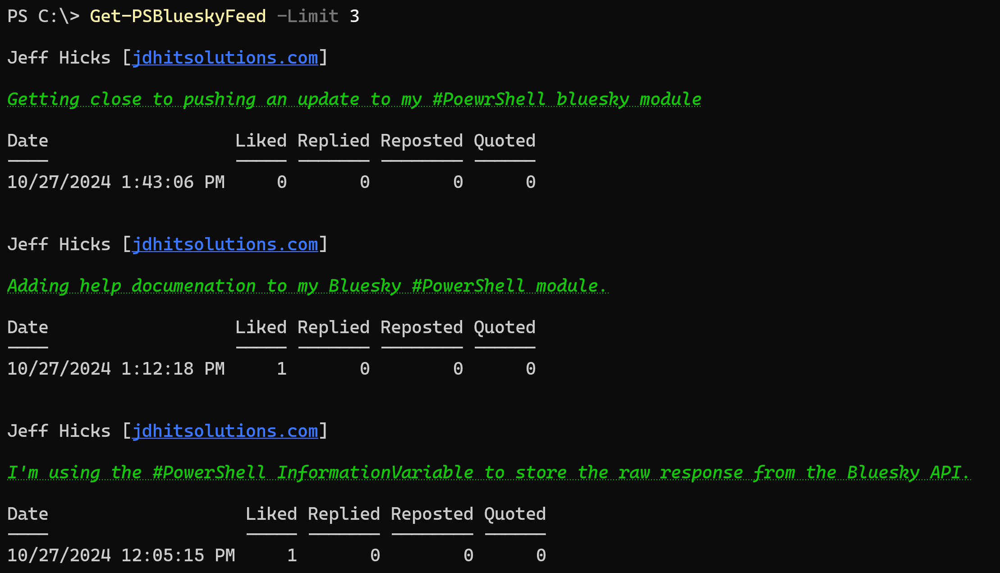
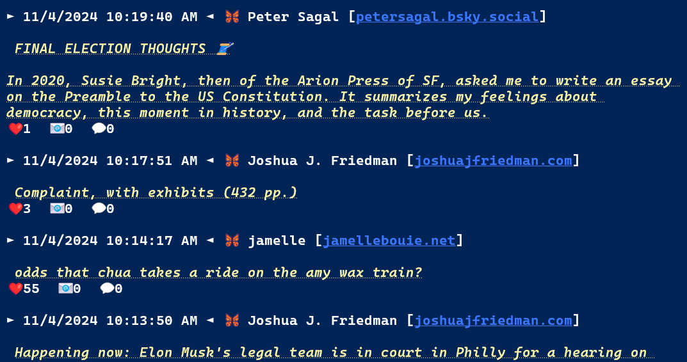
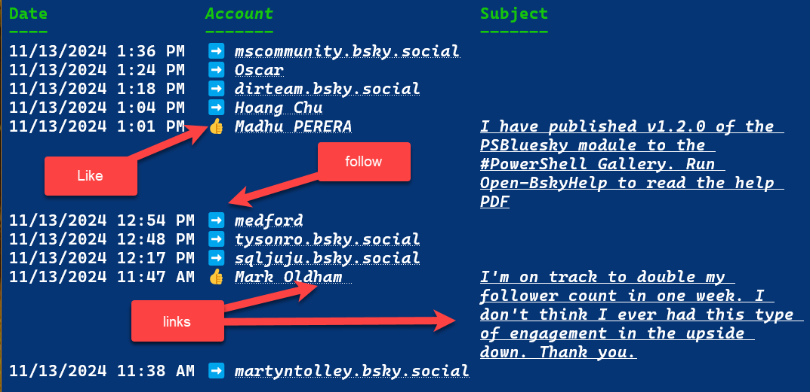

# PSBluesky

[](https://www.powershellgallery.com/packages/PSBluesky/) [](https://www.powershellgallery.com/packages/PSBluesky/)


This module is a set of PowerShell functions designed to let you interact with Bluesky API from PowerShell. Technically, the module commands are wrappers around the [atproto protocols](https://docs.bsky.app/docs/category/http-reference). The module is written for *__PowerShell 7__*, although it might work as written in Windows PowerShell with minimal changes if you wish to fork the GitHub repository. Commands *have not* been thoroughly tested for cross-platform compatibility.

The commands in the module are __not__ intended to provide complete coverage of the Bluesky API. Instead, the module focuses on the most common tasks you might want to do with Bluesky from a PowerShell prompt.

For best results, you should run this module in a PowerShell console that supports emojis and ANSI formatting like Windows Terminal.

# TUI Hacks

```pwsh
.\Invoke-BskyTui.ps1
```


## Installation

You can install the module from the PowerShell Gallery.

```powershell
Install-Module -Name PSBluesky
```

Or using `Install-PSResource` from the [Microsoft.PowerShell.PSResourceGet](https://go.microsoft.com/fwlink/?LinkId=828955) module.

```powershell
Install-PSResource -Name PSBluesky -Repository PSGallery -TrustRepository
```

You might want to also install the following modules or related modules to securely store your Bluesky credentials:

- [Microsoft.PowerShell.SecretManagement]( https://github.com/powershell/secretmanagement)
- [Microsoft.PowerShell.SecretStore](https://github.com/powershell/secretstore)

After installing this module, you should end up with these PSBluesky commands:

- [Add-BskyImage](docs/Add-BskyImage.md)
- [Find-BskyUser](docs/Find-BskyUser.md)
- [Get-BskyFeed](docs/Get-BskyFeed.md)
- [Get-BskyFollowers](docs/Get-BskyFollowers.md)
- [Get-BskyFollowing](docs/Get-BskyFollowing.md)
- [Get-BskyModuleInfo](docs/Get-BskyModuleInfo.md)
- [Get-BskyNotification](docs/Get-BskyNotification.md)
- [Get-BskyProfile](docs/Get-BskyProfile.md)
- [Get-BskySession](docs/Get-BskySession.md)
- [Get-BskyTimeline](docs/Get-BskyTimeline.md)
- [New-BskyPost](docs/New-BskyPost.md)
- [Open-BskyHelp](docs/Open-BskyHelp.md)
- [Start-BskySession](docs/Start-BskySession.md)
- [Update-BskySession](docs/Update-BskySession.md)

After importing the module you can run `Open-BskyHelp` which will open a PDF version of this document in the default application associated with PDF files. Or you can use the -`AsMarkdown` parameter to read this file using markdown formatting. Not all markdown features may properly render in the console.

You can use `Get-BskyModuleInfo` to get a summary of the module. The default output includes clickable links to online command help and the module's GitHub repository.

```powershell
PS C:\> Get-BskyModuleInfo

   Module: PSBlueSky [v2.0.0]

Name                 Alias               Synopsis
----                 -----               --------
Add-BskyImage                            Upload an image to Bluesky
Find-BskyUser        bsu                 Search for Bluesky user accounts
Get-BskyFeed         bsfeed              Get your Bluesky feed
Get-BskyFollowers    bsfollower          Get your Bluesky followers
Get-BskyFollowing    bsfollow            Get a list of Bluesky accounts...
Get-BskyModuleInfo                       Get a summary of the PSBlueSky...
Get-BskyNotification bsn                 Get Bluesky notifications.
Get-BskyProfile      bsp                 Get a Bluesky profile
Get-BskySession                          Show your current Bluesky session.
Get-BskyTimeline     bst                 Get your Bluesky timeline
New-BskyPost         skeet               Create a Bluesky post
Open-BskyHelp        bshelp              Open the PSBluesky help document
Start-BSkySession                        Start a new Bluesky session
Update-BskySession   Refresh-BskySession Refresh the Bluesky session token
```

## Authentication

### Session and Tokens

:coin: In order to send data, you must authenticate. Version 2.0.0 of this module introduces a new session model. After you import the module, you __must run__ `Start-BskySession` to initialize the module and setup module-scoped variables.

```powershell
Start-BskySession -credential $cred
```

The credential should be a PSCredential object representing your Bluesky username (handle) and password.

This command will create a hidden session object that will be called from other module commands to get the necessary authentication token for the `Invoke-ResetMethod` header. The access token has a limited lifetime unless it is refreshed. Beginning with version 1.2.0, the module will refresh the token every 15 minutes through a background runspace using a synchronized hashtable. If you remove the module, the runspace will be removed as well.

Run `Get-BskySession` to see your current session information.

```powershell
PS C:\> Get-BskySession

   User: jdhitsolutions.com

Active AccessToken             RefreshToken            Age
------ -----------             ------------            ---
True   eyJ0eXAiOiJhdCtqd3Qi... eyJ0eXAiOiJyZWZyZXNo... 00:05:41.5115796
```

If you want to manually test the Bluesky API in your own code, you can use the access and refresh token properties from this object.

```powershell
PS C:\> $bskySession = Get-BskySession
PS C:\> $access = $bskySession.AccessToken
PS C:\> $refresh = $bskySession.RefreshToken
```

However, it is still possible you will encounter an expired token error message. If you do, you can run `Update-BskySession` to refresh the token.

```powershell
Get-BSkySession | Update-BskySession
```

If this also fails, remove the module, re-import and start a new Bluesky session, including re-running `Start-BskySession`.

### Credentials :passport_control:

You will need to create a PSCredential object with your Bluesky username and password. __The username is case-sensitive__. For automation purposes, you can use the Secrets management module to store your credential. Write your own code to retrieve the credential and pass it to the module commands.

You might want to use `PSDefaultParameterValues` to set the credential for all commands.

```powershell
$PSDefaultParameterValues['*-Bsky*:Credential'] = $BlueskyCredential
```

You should only need this credential for `Start-BskySession`.

__This module does not use 2FA__. It is possible this module will move to using app passwords which would require a different authentication process but eliminate the need for credentials.

## Rate Limits

The commands in this module use the public Bluesky API which means there are [rate limits](https://docs.bsky.app/docs/advanced-guides/rate-limits). If you exceed the rate limit, you will get an error message. You will need to wait until the rate limit resets.

:warning: There is a rate limit of 300 new sessions per day. This shouldn't be an issue for most people unless you are testing code or running some sort of high-volume automation.

## Posting

:email: Use `New-BskyPost`, or its alias `skeet`, to post a message to Bluesky. There are parameters to include an image. If you include an image, the `New-BskyPost` command will call `Add-BskyImage` to upload the image. It is strongly recommended that you included ALT text for the image.

```powershell
$param = @{
    Message   = "Getting close to sharing my #PowerShell Bluesky code."
    ImagePath = "C:\work\MsPowerShell.jpg"
    ImageAlt  = "Ms. PowerShell"
    Verbose   = $true
}
New-BskyPost @param
```

The output is a URL to the post.

If your message contains a URL, it will be converted to a clickable link. Make sure your link is surrounded by white space. Beginning with v1.0.0, you can post Markdown style links.

```powershell
PS C:\> $m = "Testing multiple Markdown style links from my [#PowerShell PSBluesky
module](https://github.com/jdhitsolutions/PSBluesky) which you can find on the
[PowerShell Gallery](https://www.powershellgallery.com/packages/PSBlueSky/0.6.0)"
PS C:\> skeet $m
```


This example is using the `skeet` alias for `New-BskyPost`.

## Profiles

The module has a command to retrieve a Bluesky profile.

```powershell
Get-BskyProfile jdhitsolutions.com
```

The module uses a custom format file.


The user's profile name should be a clickable link.

The object has been customized with aliases and script properties.

```powershell
PS C:\> $jeff = Get-BskyProfile
PS C:\> $jeff | Select-Object *

Username    : jdhitsolutions.com
Display     : Jeff Hicks
Created     : 5/21/2023 10:44:48 AM
Description : PowerShell Author/Teacher/MVP/Guide ✍️
              Prof. PowerShell Emeritus 🎓
              Grizzled and grumpy IT Pro - https://jdhitsolutions.github.io/
              🎼Amateur composer - https://musescore.com/user/26698536
              Wine drinker 🍷🐶 and dog lover
Avatar      : https://cdn.bsky.app/img/avatar/plain/did:plc:ohgsqpfsbocaaxusxqlgfvd7/
              bafkreifdfahcjmytu3iw2aj2d3howu6q7twkta3h23qmlve2d2mvo5sily@jpeg
Posts       : 734
Followers   : 1267
Following   : 319
Lists       : 1
URL         : https://bsky.app/profile/jdhitsolutions.com
DID         : did:plc:ohgsqpfsbocaaxusxqlgfvd7
Name        : jdhitsolutions.com
Age         : 547.02:06:27.3639712
```

## :couple: Followers

You can retrieve a list of your followers. You can specify a number of followers between 1 and 100. The default is 50.

```powershell
Get-BskyFollowers -Limit 2
```


The custom formatting includes a clickable link to the follower's profile if running in Windows Terminal or a console that supports hyperlinks.

You can pipe the follower object to `Get-BskyProfile` to retrieve more information.

```powershell
PS C:\>$f= Get-BskyFollowers
PS C:\> $f[12] | Get-BskyProfile

Jess Pomfret [jpomfret.bsky.social]

Database Engineer with a passion for automation, proper football
and fitness. She/Her.


Created              Posts Followers Following Lists
-------              ----- --------- --------- -----
8/14/2023 3:58:44 PM   125       236       157     1
```

The default behavior is to retrieve between 1 and 100 followers. Or you can use the `-All` parameter to retrieve all followers.

## Searching for Users

You can search for Bluesky users with `Find-BskyUser`. The default behavior is to search for a user by name. The search is case-insensitive

```powershell
Find-BskyUser -UserName "jeff h" -Limit 3
```



The default output includes clickable links to the user's profile. This object too has been customized with aliases and script properties.

```powershell
PS C:\> Find-BskyUser -UserName "jeff h" -Limit 2 |
Select-Object *Name,Description,Created,Age

DisplayName : F-O Loignon
UserName    : foloignon.bsky.social
Description : « Un p’tit gosseux » - MBC
              « Une caricature » - H. Buzetti
              « L’osti de tapette communiste woke » - Un pirate

              Je suis pas mal l’amalgame de tout ce que Jeff Fillion haït :
              prof, artiste, écolo,socialiste, LGBT, féministe, antiraciste,
              intello, etc.
Created     : 10/5/2023 8:09:28 PM
Age         : 409.16:46:04.9286865

DisplayName : Jeff H
UserName    : jeffhechtaz.bsky.social
Description : Phoenix, AZ ~ Copywriter by day ~ Musician by night ~ Bass
              (the instrument, not the fish) ~
              Proud Liberal ~ Commanders football ~ F1 ~ #BassGuitar 🎸~
              #RaiseHail 🏈 ~ #ScuderiaFerrari
              🏎️ ~ #VoteBlue 🌊
Created     : 11/11/2024 1:05:34 PM
Age         : 6.23:49:58.3306295
```

The value you specify for the user name will also search the user's description property. This is a handy way of finding users with similar interests.

```powershell
Find-BskyUser powershell
```



You can pipe the search results to `Get-BskyProfile` to retrieve more information.

```powershell
PS C:\> $p = Find-BskyUser powershell -Limit 10
PS C:\> $p | Get-BskyProfile

Chrissy LeMaire [funbucket.dev]

Dual Microsoft MVP, GitHub Star, creator of dbatools, author
http://dbatools.io/book 🏳️‍🌈

Totally into PowerShell, SQL Server and AI.

📍 North of France


Created               Posts Followers Following Lists
-------               ----- --------- --------- -----
4/24/2023 12:12:00 PM   688      1435       614     0
...
```

## Following

Likewise, you can get a list of all the accounts you are following.

```powershell
Get-BskyFollowing -limit 3
```


As with followers, the default behavior is to retrieve between 1 and 100 accounts you are following. Or you can use the `-All` parameter to retrieve all accounts you are following.

## Feed :newspaper:

Use `Get-BskyFeed` to retrieve the latest posts from *your* feed. You can query for 1 to 100.

```powershell
Get-BskyFeed -Limit 3
```
The default output uses a custom format file. The current behavior is to get posts and replies.



The formatted output includes clickable links to the the author, which might be different than you if reposting, and the post. For best results, run PowerShell 7 in Windows Terminal.

## Timeline :calendar:

If you want to view items from your timeline, use the `Get-BskyTimeline` command. You can specify a limit of 1 to 100.The default is 50.

```powershell
Get-BskyTimeline -Limit 25
```

The command uses a custom format file.



The default formatted output includes clickable links to the author and the post.

## Notifications :bell:

You can retrieve your notifications with `Get-BskyNotification`. You can specify a limit of 1 to 100. The default is 50.

```powershell
 Get-BskyNotification -limit 10
 ```

The default formatted output includes clickable links to the author and the liked or reposted skeet. Long account names will be truncated in the formatted output.



- :thumbsup: Like
- :arrow_right: Follow
- :arrows_counterclockwise: Repost
- :leftwards_arrow_with_hook:  Reply

## :information_source: Information and Troubleshooting

The commands in this module should write the raw response from the API request to the Information stream. Some commands might include additional information.

```powershell


The output will be an object.

```powershell
PS C:\> $v.MessageData | Select-Object did,handle,*count

did            : did:plc:ohgsqpfsbocaaxusxqlgfvd7
handle         : jdhitsolutions.com
followersCount : 322
followsCount   : 177
postsCount     : 543
```

You might want to set a default parameter value.

```powershell
$PSDefaultParameterValues['*-*Sky*:InformationVariable'] = "iv"
```

## Other Module Features

### Type Extensions

You are encourage to pipe command results to `Get-Member` to discover additional properties you might find useful.

```powershell
PS C:\> Get-BskyProfile thedavecarroll.com |
Format-List Name,Description,Created,Age

Name        : thedavecarroll.com
Description : #PowerShell #Developer and enthusiast with a side of #DevOps,
              #Python, infrastructure, and
              #RetroComputing. Lifelong #cinephile and #punster.

              #Aspie #INTJ #9w1
              He/Him

              https://thedavecarroll.com
Created     : 4/29/2023 6:52:59 AM
Age         : 569.04:06:51.6915207
```

### Custom Verbose Messaging

This module uses ANSI formatting with localized string data and customized verbose messaging.


## Roadmap :world_map:

I have a short list of items on my wish list:

- Add support posting multiple images
- Add support for posting video
- Add commands to work with direct messages, aka chat
- Maybe create a TUI-base reader for your timeline

If you are testing the module and think you've found a bug, please post an __[Issue](https://github.com/jdhitsolutions/PSBlueSky/issues)__. For all other topics and questions, including feature requests, please use the repository's __[Discussions](https://github.com/jdhitsolutions/PSBlueSky/discussions)__ section. I am open to pull requests if you have a feature you'd like to add. I especially would love to see the Pester tests expanded and the pending tests completed.

> You can find me on Bluesky as [jdhitsolutions.com](https://bsky.app/profile/jdhitsolutions.com).
